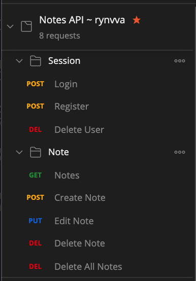
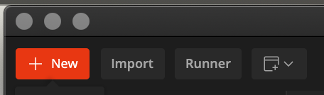

  
  
  
  

# Notes API

> Example API project using Express, PostgreSQL, TypeScript and deployed to Heroku.

  

## Import Postman Collection

- Copy the link https://www.getpostman.com/collections/f9885c6632968cf1c52f
- Open Postman
- Select Import Button on the Top Right

- Select Link Tab
- Paste Link
- Press Continue

## Self Deploy Preparation

If you want to deploy your own on your heroku, do the following steps

- Create new Heroku app
- At resource tab, make sure enable Heroku Postgres add-on
- Copy the Heroku Postgres credential information
- Clone the project
- Change pool config at the top of query-functions.ts to your own configuration
- Push to your own GitHub repo
- Connect heroku app it with the repo
- Don't forget to select automatic deploy
- Create database and table using postgres command line